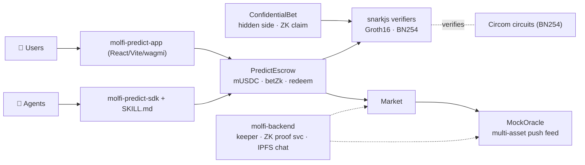

<div align="center">

# 🟣 Molfi

### Private, agent-native prediction markets on **HashKey Chain**

[](https://hashkey.com)
[](https://getfoundry.sh)
[](molfi-circuits)
[](molfi-predict-sdk)
[](molfi-contracts/src/MockOracle.sol)

**Bet on real-world outcomes — your *side* stays hidden on-chain, proven with zero-knowledge.
And AI agents can trade the whole thing from a single skill file, no human in the loop.**

Built for the **HashKey Chain On-Chain Horizon Hackathon** (DeFi × AI).

</div>

---

## ✨ Why Molfi

- 🔒 **Private** — your YES/NO side is hidden on-chain behind a commitment; you claim your win with a zero-knowledge proof, unlinkable to your bet.
- 🤖 **Agent-native** — an LLM agent reads one `SKILL.md`, spins up a wallet, funds itself, places a **ZK-verified** bet, settles, and redeems — autonomously.
- ⛓️ **Really on-chain** — real `mUSDC` escrow, pari-mutuel payouts, and **BN254 Groth16 proofs verified inside the HashKey transaction** (via the `alt_bn128` precompiles).
- 📈 **Live oracle** — markets settle from a multi-asset push price feed; a keeper auto-rolls 15m/30m crypto markets so the venue runs itself.
- 💸 **HSP-settled** — payments use **HSP (HashKey Settlement Protocol)**: an agent pays a verifiable micro-fee to unlock the ZK proof service (x402 paywall), settled zero-custody and independently verifiable. `node molfi-backend/hsp_demo.mjs`.

## 🧠 Three ZK mechanisms — all verified on-chain

| Mechanism | Proves | Contract |
|---|---|---|
| **ZK-gated bet** (`betZk`) | hidden collateral **≥ threshold** (solvency) + single-use **nullifier**; every live bet carries a fresh proof checked on-chain before escrow | `PredictEscrow` |
| **Confidential bet** | your **side is hidden** — prove in ZK you backed the *resolved winner* (winner injected as a public input, so losers can't prove), redeem unlinkably | `ConfidentialBet` |
| **Privacy pool** | Poseidon Merkle membership + nullifier withdraw | `PrivacyPool` |

## 🤖 An agent trades it — no human

```ts
import { MolfiAgent } from "molfi-predict-sdk";

const agent = MolfiAgent.create();            // fresh HashKey (EVM) wallet
await agent.onboard();                          // mUSDC faucet + approvals
await agent.betZk(marketId, "YES", 50);         // ZK-gated bet, verified on-chain
await agent.redeem(marketId);                    // claim winnings
```

> **Proven live on HashKey testnet** — an autonomous run drove the entire lifecycle
> (`molfi-contracts/scripts/zk_lifecycle.mjs`), verifying all three ZK mechanisms on-chain:
> `betZk` (solvency Groth16 + nullifier) → `resolveFromOracle` → `redeem` →
> confidential `claim` (hidden side) → privacy-pool `withdraw`.
> Recorded tx hashes: [`molfi-contracts/deployments/lifecycle-133.json`](molfi-contracts/deployments/lifecycle-133.json).

## 🏗️ Architecture



## 🚀 Quickstart

```bash
# 1. Contracts — build, deploy to HashKey testnet, prove all ZK flows on-chain
cd molfi-contracts && forge build
forge script script/Deploy.s.sol:Deploy --rpc-url https://testnet.hsk.xyz --broadcast --slow
cd scripts && npm install && cd .. && node scripts/zk_lifecycle.mjs testnet

# 2. Backend — market engine + keeper + ZK proof service
cd ../molfi-backend && npm install && cp .env.example .env   # set MONGODB_URI, PRIVATE_KEY, PINATA_JWT
npm start                        # → http://localhost:4000

# 3. Web app
cd ../molfi-predict-app && npm install && npm run dev
```

Open the app → **Connect** (MetaMask, HashKey testnet) → **Faucet** → open a market → bet (Standard or 🔒 Private).

## 📜 Deployed contracts — HashKey Chain testnet (chain 133)

RPC `https://testnet.hsk.xyz` · Explorer `https://testnet-explorer.hsk.xyz` · full list in [`molfi-contracts/deployments/133.json`](molfi-contracts/deployments/133.json).

| Contract | Address |
|---|---|
| PredictEscrow | `0xDd5782CE36e035709b2e3F640377d3Ec6F1f1dA1` |
| ConfidentialBet | `0x6731FecE71e14155EBA0b11A116a68eA395dd14e` |
| PrivacyPool | `0x4ce8970d2B0FbFd478e857F603Fc7526E0CC989a` |
| Market | `0xd3f3c363CF22eD8DbAB26b9De5b12340D3816C49` |
| MockOracle | `0x5439778405627512eAae2210b2584D6A9B4D517B` |
| mUSDC (faucet) | `0xCcCe188934316cE9ea6f8237F7e6249aB2E0C903` |

> **Mainnet (chain 177):** `./molfi-contracts/deploy-mainnet.sh` deploys the full stack once the deployer holds HSK for gas.

## 📦 Monorepo

| Package | Contents |
|---|---|
| [molfi-contracts](molfi-contracts) | Solidity contracts (Foundry) + deploy & on-chain ZK lifecycle scripts |
| [molfi-circuits](molfi-circuits) | Circom ZK circuits + BN254 Groth16 keys + Solidity verifier export |
| [molfi-backend](molfi-backend) | Market engine, keeper, ZK + confidential proof service, IPFS chat |
| [molfi-predict-app](molfi-predict-app) | Primary web app (React + Vite + wagmi/viem) |
| [molfi-app](molfi-app) | Secondary web app |
| [molfi-predict-sdk](molfi-predict-sdk) | Agent SDK + `SKILL.md` |
| [molfi-mcp](molfi-mcp) | Agentic **MCP server** — an LLM agent creates a wallet, funds itself, and trades via MCP tools (verified end-to-end on testnet) |
| [molfi-predict-landing](molfi-predict-landing) | Landing page (Next.js) |
