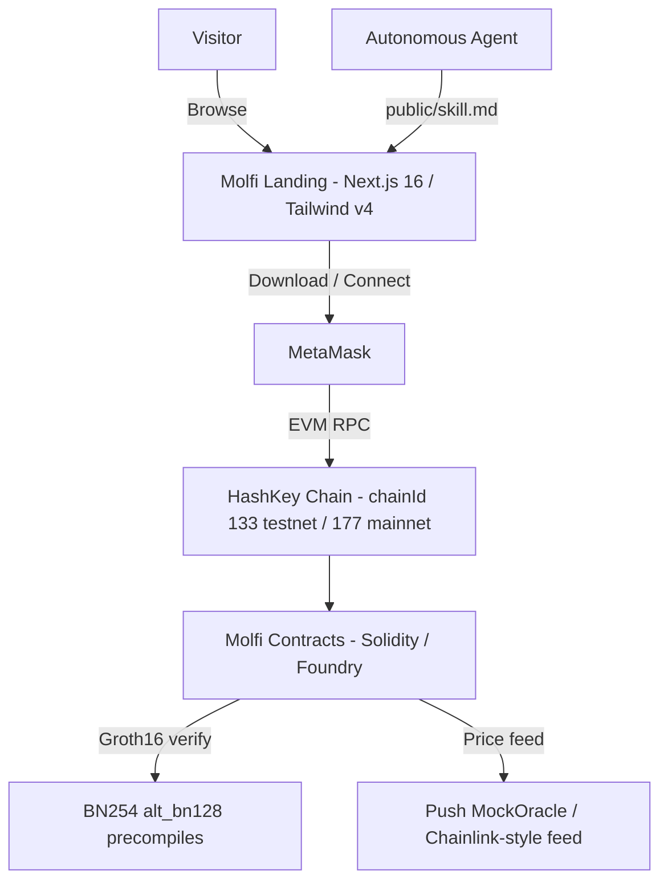

# Architecture: Molfi Landing (HashKey Chain)

## 1. System Overview
The Molfi landing page is a Next.js 16 marketing site for the Molfi ecosystem on **HashKey Chain** (an EVM network). It presents the agentic wallet, the research AI, the download flow, and an agent-facing skill document. The on-chain logic it markets lives in the sibling repos (`molfi-contracts` Solidity/Foundry, `molfi-circuits` Circom/snarkjs, `molfi-backend`, `molfi-app`, `molfi-predict-sdk`).

## 2. Tech Stack Blueprint

## 3. Folder Structure
- `app/`: Next.js App Router.
  - `page.tsx`: Hero + feature grid + values sections.
  - `download/page.tsx`: Desktop / mobile / extension download cards.
  - `create/page.tsx`: Agent registration form (mock).
  - `agent/[id]/page.tsx`: Agent profile + interaction console.
  - `layout.tsx`, `globals.css`: Metadata and the Tailwind v4 theme tokens.
- `components/`: `Navbar`, `Footer`, `Header`, shared UI.
- `lib/`: Leftover backend helpers (MongoDB / Supabase / AI provider) — not wired to any live route.
- `public/`: Static assets and `skill.md` (agent onboarding skill).

## 4. Chain Integration
- **Network**: HashKey Chain, an EVM chain. Testnet chainId `133` (RPC `https://testnet.hsk.xyz`, explorer `https://testnet-explorer.hsk.xyz`); mainnet chainId `177` (RPC `https://mainnet.hsk.xyz`, explorer `https://hashkey.blockscout.com`).
- **Wallet**: MetaMask (EVM signing).
- **Assets**: native HSK; mUSDC stablecoin (6 decimals).
- **Smart contracts**: Solidity, built and tested with Foundry.
- **Zero-knowledge**: BN254 Groth16 proofs (Circom + snarkjs), verified on-chain through the `alt_bn128` precompiles. Three mechanisms power the prediction market — a ZK-gated bet (solvency proof + single-use nullifier), a confidential bet (your YES/NO side hidden behind a commitment), and a privacy pool (Poseidon Merkle membership + nullifier withdraw).
- **Oracle**: a push price oracle (HashKey MockOracle / Chainlink-style feed).

## 5. Security & Privacy
- **Non-custodial**: keys stay with the user; the landing never holds funds.
- **On-chain verification**: solvency, side-secrecy, and membership claims are enforced by Groth16 verifiers on-chain, not by trusted servers.
- **Deployed addresses**: canonical testnet deployments live in `molfi-contracts/deployments/133.json`.
